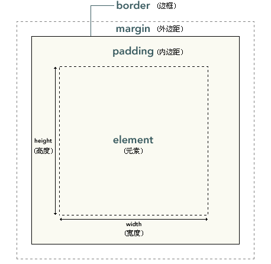

# CSS(Cascading Style Sheets)

## @media

通过@media 实现不同设备响应式布局

```css
/* Extra small devices (phones, 600px and down) */
@media only screen and (max-width: 600px) {
  .example {
    background: red;
  }
}
/* Small devices (portrait tablets and large phones, 600px and up) */
@media only screen and (min-width: 600px) {
  .example {
    background: green;
  }
}
/* Medium devices (landscape tablets, 768px and up) */
@media only screen and (min-width: 768px) {
  .example {
    background: blue;
  }
}
/* Large devices (laptops/desktops, 992px and up) */
@media only screen and (min-width: 992px) {
  .example {
    background: orange;
  }
}
/* Extra large devices (large laptops and desktops, 1200px and up) */
@media only screen and (min-width: 1200px) {
  .example {
    background: pink;
  }
}
```

## CSS 基础语法

```css
selector {
  property: value;
}
```

- visibility:hidden; //100%透明元素
- display:none; //去除元素
- display:inline; //转化为内联元素  
  内联元素只需要必要的宽度，不强制换行。

```html
<!--以下元素默认为内联元素-->
<span>
  <a> </a
></span>
```

- display:block; //转换为块元素  
  块元素是一个元素，占用了全部宽度，在前后都是换行符。

```html
<!--以下元素默认为块元素-->
<div>
  <h1>
    -
    <h6>
      <p></p>
      <form>
        <header>
          <footer>
            <section></section>
          </footer>
        </header>
      </form>
    </h6>
  </h1>
</div>
```

## overflow

overflow 属性可以控制内容溢出元素框时在对应的元素区间内添加滚动条。 | value | 描述 | | ------- | -------------------------------------------------------- | | visible | 默认值。内容不会被修剪，会呈现在元素框之外。 | | hidden | 内容会被修剪，并且其余内容是不可见的。 | | scroll | 内容会被修剪，但是浏览器会显示滚动条以便查看其余的内容。 | | auto | 如果内容被修剪，则浏览器会显示滚动条以便查看其余的内容。 | | inherit | 规定应该从父元素继承 overflow 属性的值。 |

## CSS 框模型



## [CSS 定位](https://www.w3schools.com/css/css_positioning.asp)

- `position: static;`  
  It is always postioned according to the normal flow of the page!The top, right, bottom, and left properties 无效!!
- `position: relative;`  
  通过 top, right, bottom, and left 实现相对与静态位置的平移,其他元素不会移动!!
- `position: fixed;`  
  通过 top, right, bottom, and left 固定到 viewport 的某个位置!even if the page is scrolled!
- `position: absolute;`  
  An element with position: absolute; is positioned relative to the nearest positioned ancestor (instead of positioned relative to the viewport, like fixed).  
  However; if an absolute positioned element has no positioned ancestors, it uses the document body, and moves along with page scrolling.  
  Note: A "positioned" element is one whose position is anything except static.
- `position: sticky;`  
  An element with position: sticky; is positioned based on the user's scroll position. A sticky element toggles between relative and fixed, depending on the scroll position. It is positioned relative until a given offset position is met in the viewport - then it "sticks" in place (like position:fixed).
- `z-index: -1;`  
  Overlapping Elements

## [CSS 对齐](https://www.runoob.com/css/css-align.html)

- 元素居中:margin: auto;
- 文本居中:text-align: center;
- 其他方法....

## CSS 尺寸

TODO:

# CSS Basic 2019

[CSS SELECTOR](http://www.w3school.com.cn/cssref/css_selectors.asp) | [CSS PROPERTY](http://www.w3school.com.cn/cssref/index.asp)

## CSS Format

`select {property: value1,value2;} `

### select use "," means or

` select1,select2 {`  
 `property1: value1,value2;`  
 `property2: value2,value2;`  
`}`

### select use " " means if{ if{ } }

` select1 select2 {`  
 `property1: value1,value2;`  
 `property2: value2,value2;`  
`}`

## Styles

### background

`p {background-color: gray;}`  
`body {background-image: url(/i/eg_bg_04.gif);}`

### text 缩进

`p {text-indent: 5em;}`

### 字间隔

`p.spread {word-spacing: 30px;}`

### 字体居中

`h1 {text-align:center}`

### css 单位

| 单位 | 描述                        |
| ---- | --------------------------- |
| %    | 百分比                      |
| in   | 英寸                        |
| cm   | 厘米                        |
| mm   | 毫米                        |
| em   | 一个当前字体尺寸            |
| ex   | 一个当前字体尺寸的一半      |
| pt   | 磅(1 pt 等于 1/72 英寸)     |
| pc   | 12 点活字 (1 pc 等于 12 点) |
| px   | 像素                        |

## 定位

`h { position:absolute; left:100px; top:150px }`  
`h { position:relative; left:-20px }`
