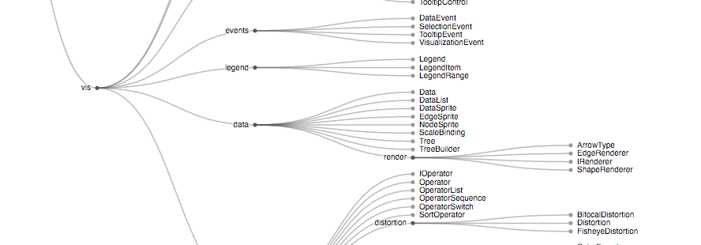
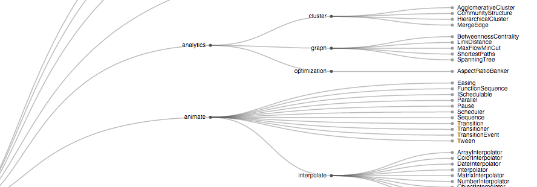

## Hierarchy

- d3.hierarchy:是一个抽象的分层数据结构,To visualize a hierarchy:
  - d3.tree vs d3.cluster  
      
    
  - d3.tree()  
    Lays out the specified root hierarchy, assigning the x,y,size,... properties on root and its descendants.
  - d3.treemap
  - d3.sunburst

## Zoom&Drag

- d3.zoom.translateExtent:拖拽边界设定
- d3.zoom.scaleExtent:缩放上下限设定
