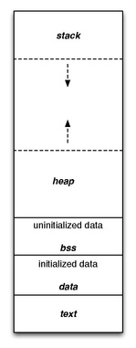

## [Web Developer RoadMap](https://github.com/kamranahmedse/developer-roadmap)

## [服务端高并发分布式架构演进](https://segmentfault.com/a/1190000018626163)

## [Creating a responsive graph with Angular and D3](https://medium.com/@jeanphilippelemieux/creating-a-responsive-graph-with-angular-and-d3-b45bb8065588)

    step1:
    ```
    npm install d3 --save
    npm install @types/d3 --save-dev
    ```

## ORM:对象关系映射(Object Relational Mapping)

- JDBC ORMs:  
   dbutils: 是对 jdbc 进行了相对简单的包装, 需要在代码中写 sql 语句  
   Mybatis: 进一步封装 jdbc,Sql 语句写在配置文件中,面向对象操作,有一二级缓存功能  
   Hibernate: 对 jdbc 封装得最彻底的框架,纯面向对象,可以不用写 SQL
- [Node ORM: sequelize ](https://www.cnblogs.com/y-yxh/p/6005729.html)

## SSR:SERVER SIDE RENDER

## Node.js REPL(Read Eval Print Loop:交互式解释器) 表示一个电脑的环境，类似 Window 系统的终端或 Unix/Linux shell，我们可以在终端中输入命令，并接收系统的响应。

Node 自带了交互式解释器，可以执行以下任务：读取 - 读取用户输入，解析输入了 Javascript 数据结构并存储在内存中。执行 - 执行输入的数据结构打印 - 输出结果循环 - 循环操作以上步骤直到用户两次按下 ctrl-c 按钮退出。 Node 的交互式解释器可以很好的调试 Javascript 代码。

## HTTPS(Hyper Text Transfer Protocol over Secure Socket Layer)

## SSL(Secure Socket Layer)

## [angular2-chartjs use github](https://github.com/emn178/angular2-chartjs)

    1. `npm install --save angular2-chartjs`
    2.
        ```
            import { ChartModule } from 'angular2-chartjs';
            @NgModule({
                imports: [ ChartModule ]
                // ...
            })
            export class AppModule {
            }
        ```
    3.  ```javascript
        //javascript
        type = 'line';
        data = {
        labels: ["January", "February", "March", "April", "May", "June", "July"],
        datasets: [
            {
            label: "My First dataset",
            data: [65, 59, 80, 81, 56, 55, 40]
            }
        ]
        };
        options = {
        responsive: true,
        maintainAspectRatio: false
        };
        ```
        ```html
        //html
        <chart [type]="type" [data]="data" [options]="options"></chart>
        ```

## Nginx 和 Haproxy(Load Balancer)

- 正向代理和反向代理正向代理：是一个位于客户端和原始服务器(origin server)之间的服务器，为了从原始服务器取得内容，客户端向代理发送一个请求并指定目标(原始服务器)，然后代理向原始服务器转交请求并将获得的内容返回给客户端。客户端必须要进行一些特别的设置才能使用正向代理。正向代理的用途： （1）访问原来无法访问的资源，如 google （2）可以做缓存，加速访问资源 （3）对客户端访问授权，上网进行认证 （4）代理可以记录用户访问记录（上网行为管理），对外隐藏用户信息反向代理：初次接触反向代理的感觉是，客户端是无感知代理的存在的，反向代理对外都是透明的，访问者者并不知道自己访问的是一个代理。因为客户端不需要任何配置就可以访问。反向代理（Reverse Proxy）实际运行方式是指以代理服务器来接受 internet 上的连接请求，然后将请求转发给内部网络上的服务器，并将从服务器上得到的结果返回给 internet 上请求连接的客户端，此时代理服务器对外就表现为一个服务器。反向代理的作用： （1）保证内网的安全，可以使用反向代理提供 WAF 功能，阻止 web 攻击大型网站，通常将反向代理作为公网访问地址，Web 服务器是内网。 （2）负载均衡，通过反向代理服务器来优化网站的负载

## wget 和 curl

想快速下载并且没有担心参数标识的需求，可以使用轻便有效的 wget。  
cURL 支持你做很多事情。你可以把 cURL 想象成一个精简的命令行网页浏览器。它支持几乎你能想到的所有协议，可以交互访问几乎所有在线内容。唯一和浏览器不同的是，cURL 不会渲染接收到的相应信息。

## 查询监听端口

MAC:`netstat -AaLlnW`  
linux:`netstat -nlp | grep LISTEN`

## [软件设计原则(principle)](https://github.com/kamranahmedse/developer-roadmap)

- [SOLID](https://learnku.com/articles/4160/solid-notes-on-object-oriented-design-and-programming-oodoop)

  | Name | 名称 | 概念 |
  | --- | --- | --- |
  | S-SRP(Single Responsibility Principle) | 单一功能原则 | 对象应该仅具有一种单一功能 |
  | O-OCP(Opened Closed Principle) | 开闭原则 | 软件应该是对于扩展开放的，但对于修改封闭的 |
  | L-LSP(Liskov Substitution Principle) | 里氏替换原则 | 程序中的对象应该是可以在不改变程序正确性的前提下被他的子类所替换 |
  | I-ISP(Interface Segregation Principle) | 接口隔离原则 | 多个特定客户端接口要好于一个宽泛用途的接口 |
  | D-DIP(Dependency Inversion Principle) | 依赖反转原则 | 一个方法应该遵从「依赖于抽象而不是一个实例」 |

- [DRY-Don't Repeat Yourself](https://blog.csdn.net/yuanlaijike/article/details/101565)
- KISS-Keep It Simple & Stupid
- YAGNI-You Ain't Gonna Need It

## OWASP-Open Web Application Security Project

开放式 Web 应用程序安全项目

## 设计模式

    * 单例模式
    * 生产模式
    * ....

## [计算机程序执行的内存分区](https://en.wikipedia.org/wiki/Data_segment)



## 不同数据类型的字长取决于编译器

[WIKI 64-bit data models](https://en.wikipedia.org/wiki/64-bit_computing#64-bit_data_models)  
[数据模型（LP32 ILP32 LP64 LLP64 ILP64 ）](https://www.cnblogs.com/lsgxeva/p/7614856.html)

不同的编译器采用不同的字长模型:

| Data model | short | int | long | long long | pointers | operating systems |
| --- | --- | --- | --- | --- | --- | --- |
| `ILP32` | 16 | 32 | 32 | 64 | 32 | Win32 API / Unix 和 Unix 类的系统 （Linux，Mac OS X） |
| `LLP64` | 16 | 32 | 32 | 64 | 64 | Microsoft Windows (x86-64 and IA-64) using Visual C++; and MinGW |
| `LP64` | 16 | 32 | 64 | 64 | 64 | Most Unix and Unix-like systems, e.g., Solaris, Linux, BSD, macOS. Windows when using Cygwin; z/OS |
| ILP64 | 16 | 64 | 64 | 64 | 64 | HAL Computer Systems port of Solaris to the SPARC64 |
| SILP64 | 64 | 64 | 64 | 64 | 64 | Classic UNICOS[44][45] (versus UNICOS/mp, etc.) |

<br/>
