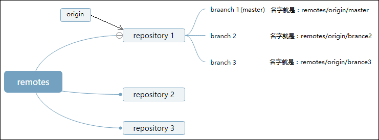

# GIT

[Learn Enough Git to Be Dangerous](https://www.learnenough.com/git-tutorial?single_page=1#cha-1_footnote-4)

## GitHub 添加 SSH keys

```
$ ssh-keygen -t rsa -C "whl7770@gmail.com" //一路回车//打开!!!! id_rsa.pub，复制里面的key
```

## locate git cmd

```
where git //windows
which git //unix
```

## after install before use

```
git config --global user.name "HongliangWang"
git config --global user.email "whl7770@gmail.com"
git config --global --list //list the global config
```

this configuration allow GIT to identify your changes by name and email address,which is especially helpful when collaborating with others!

## alias

```
git config --gloable alias.co checkout //co means checkout
```

## initializing the repository

```
[C:\myproject] $ git init
```

## make new file

```
touch index.html //unix
type null>index.html  //win ">>":append a new line
echo null>index.html  //win
```

## query status&add track file

```
git status
git add -A //add all --all
```

## commit modify

```
git commit -m //--message -a --all
```


## query latest commit message

```
git log
git log -p
```

## amend the last commit

```
git commit --amend
```

## [Connecting to GitHub with SSH](https://help.github.com/en/articles/connecting-to-github-with-ssh)

## create a new repository on the command line

```
echo "# project_name" >> README.md
git init
git add README.md
git commit -m "first commit"
git remote add origin git@github.com:wszwr003/project_name.git   //git remote rm origin
[git pull origin master]
git push -u origin master
```

## 关于 origin 和 master

git 的服务器端(remote)端包含多个 repository，每个 repository 可以理解为一个项目。而每个 repository 下有多个 branch。"origin"就是指向某一个 repository 的指针。服务器端的"master"（强调服务器端是因为本地端也有 master）就是指向某个 repository 的一个 branch 的指针。 

```
git push A B:C    
```

其中 A 和 C 是分别 remote 端的一个 repository 的名字和 branch 的名字，B 是本地端 branch 的名字意思是把本地的 B 推送到 remotes/A/C 下。当 B=C 时可以直接省略为：git push A B。比如：

```
git push origin master:master //equals
git push origin master
```

## modify eg.

```
[project_dir (master)]$ git diff
[project_dir (master)]$ git status
[project_dir (master)]$ git add -A
[project_dir (master)]$ git commit -m "modify something"
[project_dir (master)]$ git push
```

## branch and merge

```
[project_dir (master)]$ git checkout -b about-page  //checkout & make an new branch
[project_dir (about-page)]$

[project_dir (about-page)]$ git branch //query the current branches
* about-page
master

[project_dir (about-page)]$ git checkout master //from about-page into master
[project_dir (master)]$
[project_dir (master)]$ git merge about-page //merge about-page into master

git branch -d about-page  //if merged
git branch -D about-page  //even not merged
```

## create tag

```
$ git tag -a v1.4-annotated -m 'my version 1.4'
$ git tag v1.4-lightweight
$ git tag
$ git show v1.4
```

# .gitignore

规则 作用  
`/mtk` 过滤整个文件夹  
`*.zip` 过滤所有.zip 文件  
`/mtk/do.c` 过滤某个具体文件  
`!/mtk/one.txt` 追踪（不过滤）某个具体文件  
注意：如果你创建.gitignore 文件之前就 push 了某一文件，那么即使你在.gitignore 文件中写入过滤该文件的规则，该规则也不会起作用，git 仍然会对该文件进行版本管理。  
配置语法  
以斜杠“/”开头表示目录；  
以星号“\*”通配多个字符；  
以问号“?”通配单个字符;  
以方括号“[]”包含单个字符的匹配列表；  
以叹号“!”表示不忽略(跟踪)匹配到的文件或目录。

## ??remote: No anonymous write access. fatal: Authentication failed

解决：通过 https-->git 暂时解决

```
git remote -v
git remote set-url origin git@github.com:wszwr003/MyNoteBook.git
```
