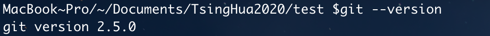
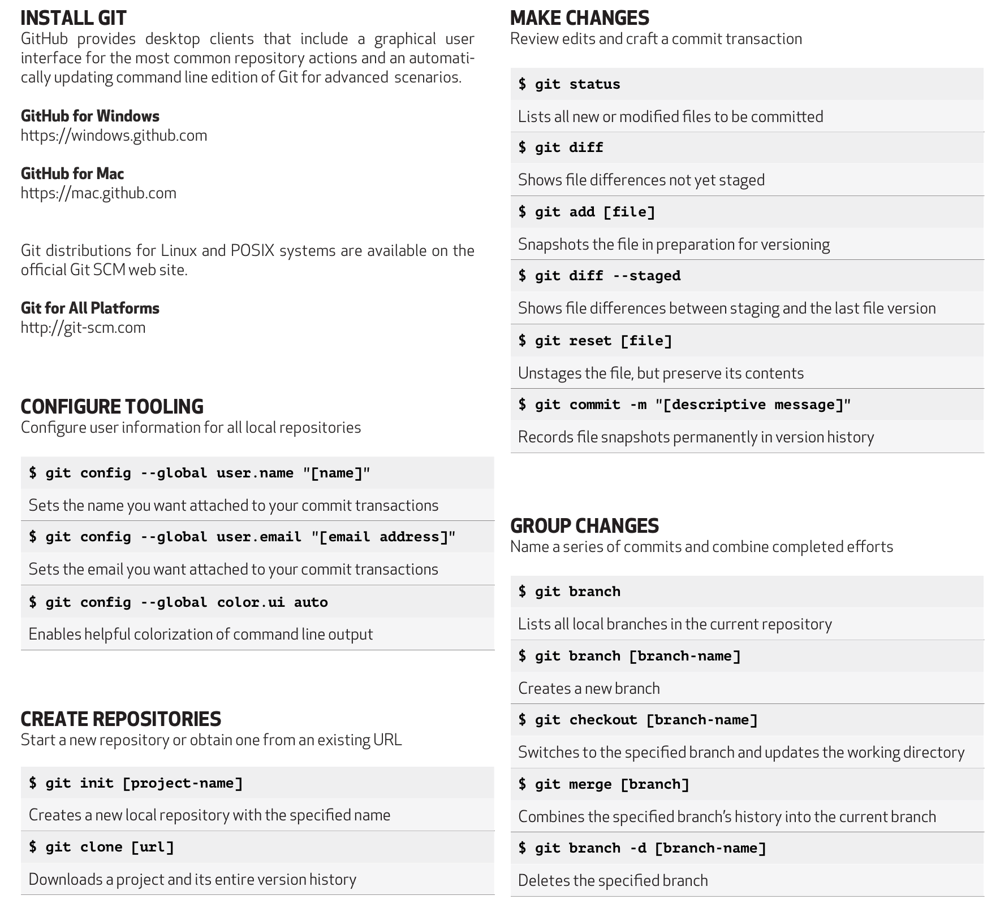
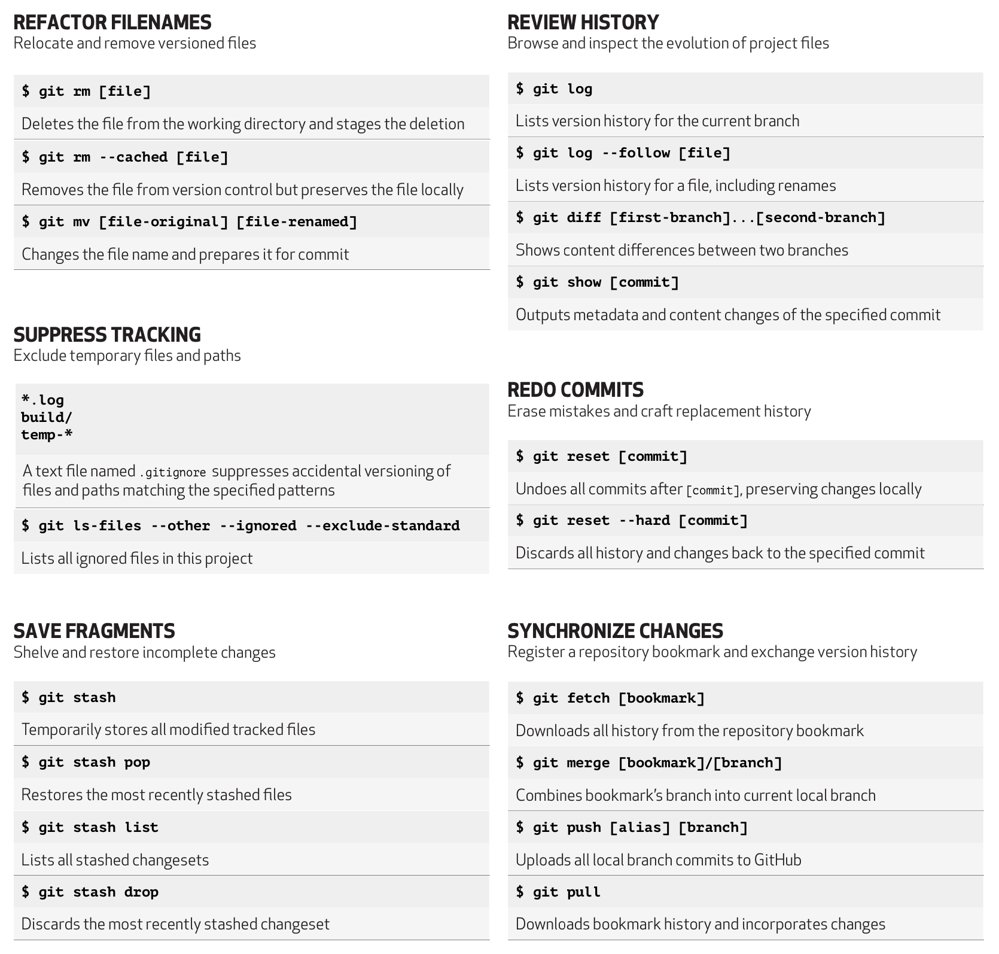

# GIT 版本控制及共享协作

## Windows 下安装 GIT

在 Windows 上安装 Git 也有几种安装方法。 官方版本可以在 Git 官方网站下载。 打开  https://git-scm.com/download/win 下载会自动开始。

- 下载安装完成后输入`git --version`检查是否安装成功： 
- 初次安装后配置 git 用户名和邮箱：

```
$ git config --global user.name "yourname"
$ git config --global user.email "youremail@example.com"
```

## 从服务器克隆项目

`$ git clone Administrator@47.101.57.243:git/project_name.git`

## 本地初始化项目

- 本地初始化 GIT:
  1. 在已有项目目录下打开命令行工具，输入`git init`初始化仓库。
  2. 新建一个 README.md 文件，用于项目基本情况描述。
  3. 新建一个.gitignore 文件用于，设置无需版本控制忽略规则。
  4. 输入`git add .`把所有变更放入暂存区。
  5. 输入`git commit -m "first init"`,提交第一个本地环境，至此本地的版本控制完成。
- 同步推送到服务器:
  1. 添加远程仓库 `$ git remote add origin Administrator@47.101.57.243:git/project_name.git`
  2. 推送到远程仓库  
     `$ git push origin master`

## 其它

### 配置 ssh 的 rsa 密钥登录

该配置可以免去使用者在连接服务器时需要手动输入密码的过程，方法是将使用者电脑上生成的公钥放到服务器进行配置。

- PC 端 shell 下输入以下命令生成密钥： `$ ssh-keygen -t rsa -C "youremail@example.com"`
- windows 公钥的生成路径为：  
  `c盘/用户/自己的用户名/.ssh/id_rsa或id_rsa.pub`

### 中心 git 服务器配置

服务器 IP：47.101.57.243 用户名：Administrator ssh 代理端口：22 可视化 GIT 网页：git.zj-instrument.net

### 基本命令检索

 
