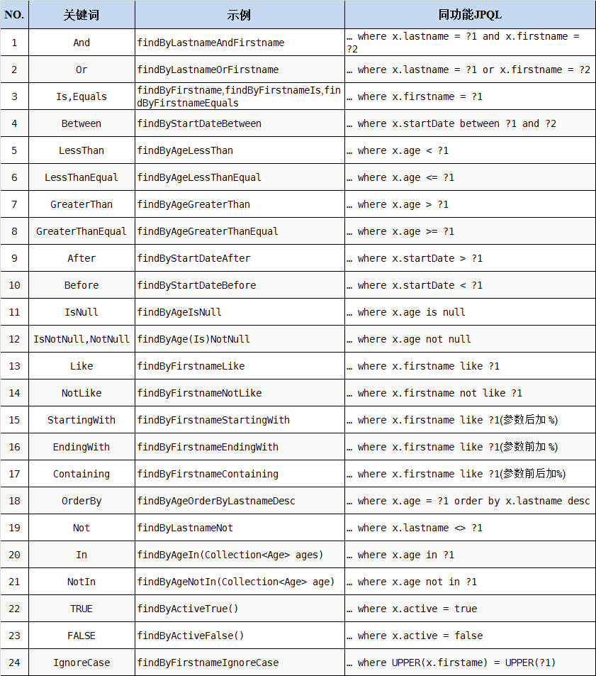

# JPA 的自由等级

1. 按照 JPA 标准名称（findBy...）  
   
2. 使用 JPQL 语句：@query("")

```java
//注意JPA NEW com.grandway.resourcemanager.payload.ResourceResponse() 返回新组装的对象
@Query("SELECT NEW com.grandway.resourcemanager.payload.ResourceResponse( " +
                "o.id," +
                "o.oltName," +
                //...
                "o.remark," +
                "CASE WHEN (onu1.modifiedTime = null) THEN cast(o.modifiedTime as string) ELSE cast(onu1.modifiedTime as string) END "
                +
                ") " +
                "FROM OltResource o " +
                "LEFT JOIN OnuChecked onu1 " +
                "ON (onu1.splLevel = 1 AND (o.onuAuthValue = onu1.authValue OR o.onuAuthValue = onu1.loid OR o.onuAuthValue = onu1.pw OR o.onuAuthValue = onu1.sn OR o.onuAuthValue = onu1.mac OR o.onuAuthValue = onu1.pppoe)) "
                +
                "LEFT JOIN OnuChecked onu2 " +
                "ON (onu2.splLevel = 2 AND (o.onuAuthValue = onu2.authValue OR o.onuAuthValue = onu2.loid OR o.onuAuthValue = onu2.pw OR o.onuAuthValue = onu2.sn OR o.onuAuthValue = onu2.mac OR o.onuAuthValue = onu2.pppoe)) "
                +
                "LEFT JOIN onu1.splChecked spl1 " +
                "LEFT JOIN onu2.splChecked spl2 " +
                "LEFT JOIN spl1.address s1ad1 " +
                "LEFT JOIN spl2.address s2ad2 " +
                "LEFT JOIN onu1.user user " +
                "LEFT JOIN onu1.checkUser cuser " +
                "WHERE (COALESCE(o.oltName,'') LIKE CONCAT('%',:oltName,'%')) " +
                "AND (COALESCE(o.oltIp,'') LIKE CONCAT('%',:oltIp,'%')) " +
                "AND (COALESCE(spl1.name,'') LIKE CONCAT('%',:spl1Name,'%')) " +
                "AND (COALESCE(spl2.name,'') LIKE CONCAT('%',:spl2Name,'%')) " +
                "AND (COALESCE(onu1.name,'') LIKE CONCAT('%',:onuName,'%')) " +
                "AND (COALESCE(spl1.checkUser,'') LIKE CONCAT('%',:checkUser,'%')) " +
                "AND (o.modifiedTime BETWEEN :timeStart AND :timeEnd OR onu1.modifiedTime BETWEEN :timeStart AND :timeEnd) ")
Page<OltResource> getCheckedCsvResource(
                String oltName, String oltIp, String spl1Name, String spl2Name, String onuName,
                String checkUser, LocalDateTime timeStart, LocalDateTime timeEnd,
                Pageable pageable);
```

3. 使用 SQL 语句：@query(value = "", countQuery = "", nativeQuery = true)

```java
@Query(value = "SELECT * FROM olt_resource as o " +
                "LEFT JOIN olt_resource_manual as orm " +
                "ON o.onu_auth_value = orm.onu_auth_value " +
                "LEFT JOIN onu_checked as onu1 " + //LEFT
                "ON (onu1.spl_level = 1 AND (o.onu_auth_value = onu1.auth_value OR o.onu_auth_value = onu1.loid OR o.onu_auth_value = onu1.pw OR o.onu_auth_value = onu1.sn OR o.onu_auth_value = onu1.mac OR o.onu_auth_value = onu1.pppoe)) "
                +
                "LEFT JOIN onu_checked as onu2 " + //LEFT
                "ON (onu2.spl_level = 2 AND (o.onu_auth_value = onu2.auth_value OR o.onu_auth_value = onu2.loid OR o.onu_auth_value = onu2.pw OR o.onu_auth_value = onu2.sn OR o.onu_auth_value = onu2.mac OR o.onu_auth_value = onu2.pppoe)) "
                +
                "LEFT JOIN spl_checked as spl1 " +
                "ON onu1.spl_checked_id = spl1.id " +
                "LEFT JOIN spl_checked as spl2 " +
                "ON onu2.spl_checked_id = spl2.id " +
                "LEFT JOIN address as s1ad " +
                "ON s1ad.spl_checked_id = spl1.id " +
                "LEFT JOIN address as s2ad " +
                "ON s2ad.spl_checked_id = spl2.id " +
                "LEFT JOIN user s1u " +
                "ON spl1.user_id = s1u.id " +
                "LEFT JOIN user s1cu " +
                "ON spl1.check_user_id = s1cu.id " +
                "LEFT JOIN user s2u " +
                "ON spl2.user_id = s2u.id " +
                "LEFT JOIN user s2cu " +
                "ON spl2.check_user_id = s2cu.id " +
                "WHERE (COALESCE(o.olt_name,'') LIKE CONCAT('%',?1,'%')) " +
                "AND (COALESCE(o.olt_ip,'') LIKE CONCAT('%',?2,'%')) " +
                "AND (COALESCE(o.spl1_name,'') LIKE CONCAT('%',?3,'%')) " +
                "AND (COALESCE(o.spl2_name,'') LIKE CONCAT('%',?4,'%')) " +
                "AND (COALESCE(o.onu_name,'') LIKE CONCAT('%',?5,'%')) " +
                "AND (COALESCE(o.check_user_id,'') LIKE CONCAT('%',?6,'%')) " +
                "AND o.modified_time BETWEEN ?7 AND ?8 " +
                "ORDER BY ?#{#pageable}", countQuery = "SELECT count(*) FROM olt_resource as o " +
                                "WHERE (COALESCE(o.olt_name,'') LIKE CONCAT('%',?1,'%')) " +
                                "AND (COALESCE(o.olt_ip,'') LIKE CONCAT('%',?2,'%')) " +
                                "AND (COALESCE(o.spl1_name,'') LIKE CONCAT('%',?3,'%')) " +
                                "AND (COALESCE(o.spl2_name,'') LIKE CONCAT('%',?4,'%')) " +
                                "AND (COALESCE(o.onu_name,'') LIKE CONCAT('%',?5,'%')) " +
                                "AND (COALESCE(o.check_user_id,'') LIKE CONCAT('%',?6,'%')) " +
                                "AND o.modified_time BETWEEN ?7 AND ?8 ", nativeQuery = true)
Page<OltResource> getOltResource(
                String oltName, String oltIp, String spl1Name, String spl2Name, String onuName,
                String checkUser, LocalDateTime timeStart, LocalDateTime timeEnd,
                Pageable pageable);
```

4. 复杂的查询可以通过 View 视图+简单 SQL 的的方式实现

```sql
-- select from left join union right join(full outer join)
CREATE VIEW resource_view AS
	SELECT
	    o.id as id,
	    o.olt_name as oltName,
      -- ...
	    o.remark as remark,
	    CASE
	        WHEN (onu1.modified_time = null) THEN o.modified_time
	        ELSE onu1.modified_time
	    END AS modifiedTime
	FROM olt_resource as o
	    LEFT JOIN olt_resource_manual as orm ON o.onu_auth_value = orm.onu_auth_value
	    LEFT JOIN onu_checked as onu1 ON (
	        onu1.spl_level = 1 AND (
	            o.onu_auth_value = onu1.auth_value OR o.onu_auth_value = onu1.loid OR o.onu_auth_value = onu1.pw OR o.onu_auth_value = onu1.sn OR o.onu_auth_value = onu1.mac OR o.onu_auth_value = onu1.pppoe
	        )
	    )
	    LEFT JOIN onu_checked as onu2 ON (
	        onu2.spl_level = 2 AND (
	            o.onu_auth_value = onu2.auth_value OR o.onu_auth_value = onu2.loid OR o.onu_auth_value = onu2.pw OR o.onu_auth_value = onu2.sn OR o.onu_auth_value = onu2.mac OR o.onu_auth_value = onu2.pppoe
	        )
	    )
	    LEFT JOIN spl_checked as spl1 ON onu1.spl_checked_id = spl1.id
	    LEFT JOIN spl_checked as spl2 ON onu2.spl_checked_id = spl2.id
	    LEFT JOIN address as s1ad ON s1ad.spl_checked_id = spl1.id
	    LEFT JOIN address as s2ad ON s2ad.spl_checked_id = spl2.id
	    LEFT JOIN user s1u ON spl1.user_id = s1u.id
	    LEFT JOIN user s1cu ON spl1.check_user_id = s1cu.id
	    LEFT JOIN user s2u ON spl2.user_id = s2u.id
	    LEFT JOIN user s2cu ON spl2.check_user_id = s2cu.id
	UNION
	SELECT
	    o.id as id,
	    o.olt_name as oltName,
      -- ...
	    o.remark as remark,
	    CASE
	        WHEN (onu1.modified_time = null) THEN o.modified_time
	        ELSE onu1.modified_time
	    END AS modifiedTime
	FROM olt_resource as o
	    RIGHT JOIN olt_resource_manual as orm ON o.onu_auth_value = orm.onu_auth_value
	    LEFT JOIN onu_checked as onu1 ON (
	        onu1.spl_level = 1 AND (
	            o.onu_auth_value = onu1.auth_value OR o.onu_auth_value = onu1.loid OR o.onu_auth_value = onu1.pw OR o.onu_auth_value = onu1.sn OR o.onu_auth_value = onu1.mac OR o.onu_auth_value = onu1.pppoe
	        )
	    )
	    LEFT JOIN onu_checked as onu2 ON (
	        onu2.spl_level = 2 AND (
	            o.onu_auth_value = onu2.auth_value OR o.onu_auth_value = onu2.loid OR o.onu_auth_value = onu2.pw OR o.onu_auth_value = onu2.sn OR o.onu_auth_value = onu2.mac OR o.onu_auth_value = onu2.pppoe
	        )
	    )
	    LEFT JOIN spl_checked as spl1 ON onu1.spl_checked_id = spl1.id
	    LEFT JOIN spl_checked as spl2 ON onu2.spl_checked_id = spl2.id
	    LEFT JOIN address as s1ad ON s1ad.spl_checked_id = spl1.id
	    LEFT JOIN address as s2ad ON s2ad.spl_checked_id = spl2.id
	    LEFT JOIN user s1u ON spl1.user_id = s1u.id
	    LEFT JOIN user s1cu ON spl1.check_user_id = s1cu.id
	    LEFT JOIN user s2u ON spl2.user_id = s2u.id
	    LEFT JOIN user s2cu ON spl2.check_user_id = s2cu.
id;
```

```java
//interface ResourceResponseTest
public interface ResourceResponseTest {
  Long getId();
  String getOltName();
  //...
  //...
  String getRemark();
  String getModifiedTime();
}
//interface OltResourceRepository
//native SQL返回新组装的对象
@Query(value = "SELECT * FROM resource_view v ORDER BY ?#{#pageable}", countQuery = "SELECT count(*) FROM resource_view", nativeQuery = true)
Page<ResourceResponseTest> getOltResource(
                String oltName, String oltIp, String spl1Name, String spl2Name, String onuName,
                String checkUser, LocalDateTime timeStart, LocalDateTime timeEnd,
                Pageable pageable);
```
