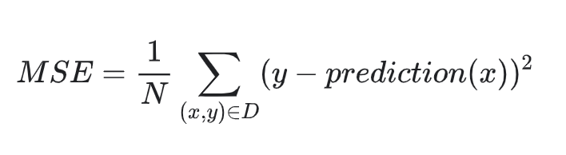
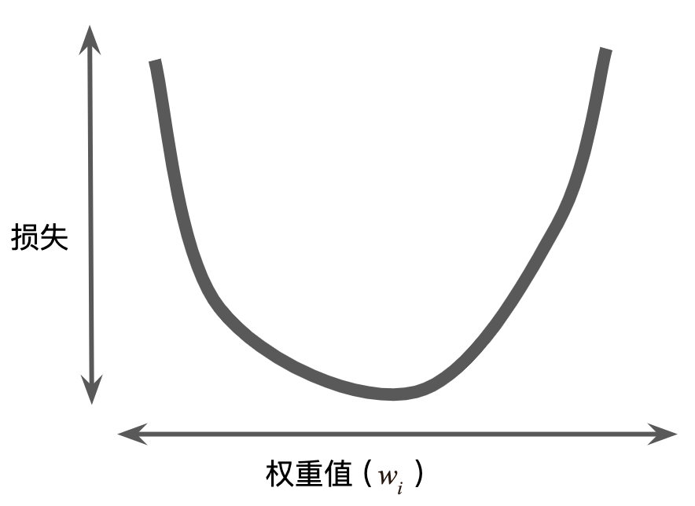
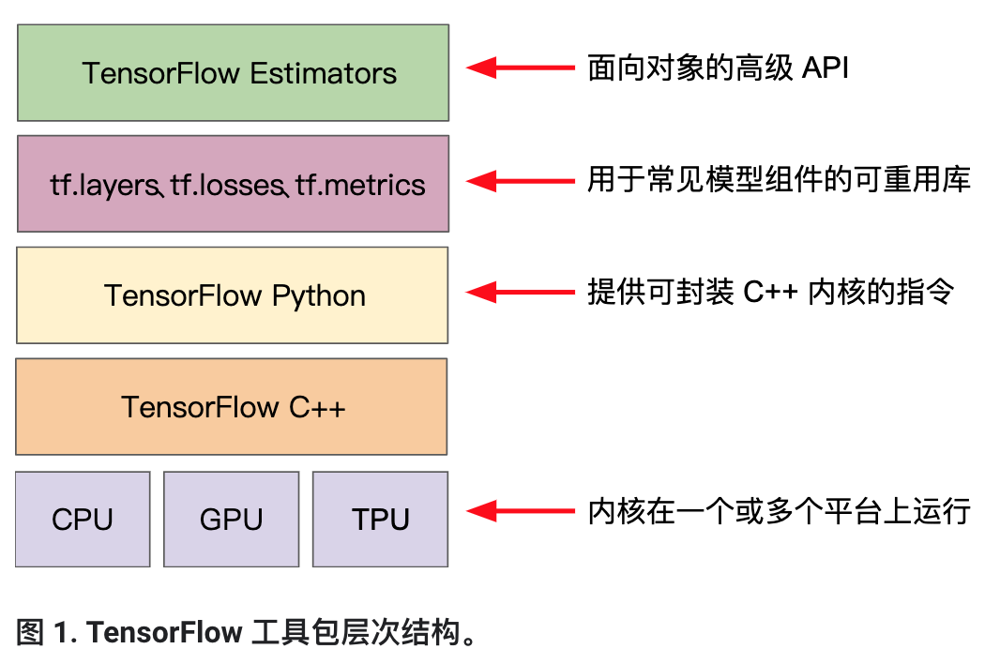

# [Google Machine Learning Courses](https://developers.google.com/machine-learning/crash-course/ml-intro)  
## Introduction to ML
* First, it gives you a tool to reduce the time you spend programming.
* Second, it will you to customize your products(100 languages tranlate).
* Third, solve problems that you,as a programmer,have no idea to solve(recognize faces,understand speech).
* Fourth, change the way you think about a problem .
  * logic -> statistics analyze 
  * mathematical science -> natural science
## Framing  
* __BASIC PRAMEOWRK:__ supervised machine learning.
* __label(y):__ it's the target we're trying to predict,something like 'spam or not spam'.
* __feature(xi):__ any piece of information,something like words in the email.  
* __example(x):__ one piece of data,for example,one email.
* __labeled example(x,y)__  
* __unlabeled example(x,?)__
* __model(prediction(x)=y'):__ the thing that doing predicting,it's the thing that we're going to create.
## Descending into ML  

## Reducing Loss
### Gradient Descent

### Learning Rate
best learn rate!
## First Steps with TF  

### TF Progarmming Exercise
* pandas  
是一种数据分析a