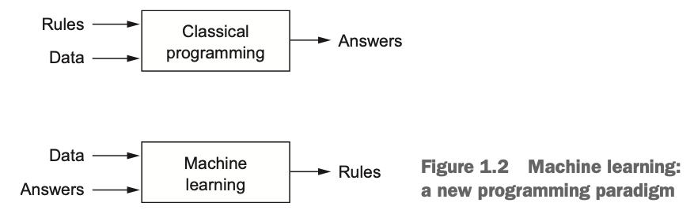

# [Google Machine Learning Courses](https://developers.google.com/machine-learning/crash-course/ml-intro)  
## Introduction to ML
* First, it gives you a tool to reduce the time you spend programming.
* Second, it will you to customize your products(100 languages tranlate).
* Third, solve problems that you,as a programmer,have no idea to solve(recognize faces,understand speech).
* Fourth, change the way you think about a problem .
  * logic -> statistics analyze 
  * mathematical science -> natural science
## Framing  
* __BASIC PRAMEOWRK:__ supervised machine learning.
* __label(y):__ it's the target we're trying to predict,something like 'spam or not spam'.
* __feature(x<sub>i</sub>):__ any piece of information,something like words in the email.  
* __example(x):__ one piece of data,for example,one email.
* __labeled example(x,y)__  
* __unlabeled example(x,?)__
* __model(prediction(x)=y'):__ the thing that doing predicting,it's the thing that we're going to create.
## Descending into ML  

## Reducing Loss
### Gradient Descent

### Learning Rate
best learn rate!
## First Steps with TF  

### TF Progarmming Exercise
* pandas  
    是一种数据分析API  
    ```python
    from __future__ import print_function
    import pandas as pd
    import numpy as np
    pd.__version__

    california_housing_dataframe = pd.read_csv("https://download.mlcc.google.cn/mledu-datasets/california_housing_train.csv", sep=",")
    california_housing_dataframe.describe()
    california_housing_dataframe.head()
    california_housing_dataframe.hist('housing_median_age')

    city_names = pd.Series(['San Francisco', 'San Jose', 'Sacramento'])
    population = pd.Series([852469, 1015785, 485199])
    citys = pd.DataFrame({ 'City name': city_names, 'Population': population})
    print(type(cities['City name']))
    cities['City name']
    population / 1000.
    np.log(population)
    population.apply(lambda val: val > 1000000)
    ```
* first steps with tensorflow  
```python
from __future__ import print_function
import math
from IPython import display
from matplotlib import cm
from matplotlib import gridspec
from matplotlib import pyplot as plt
import numpy as np
import pandas as pd
from sklearn import metrics
%tensorflow_version 1.x
import tensorflow as tf
from tensorflow.python.data import Dataset

tf.logging.set_verbosity(tf.logging.ERROR)
pd.options.display.max_rows = 10
pd.options.display.float_format = '{:.1f}'.format

california_housing_dataframe = pd.read_csv("https://download.mlcc.google.cn/mledu-datasets/california_housing_train.csv", sep=",")

california_housing_dataframe = california_housing_dataframe.reindex(np.random.permutation(california_housing_dataframe.index))
california_housing_dataframe["median_house_value"] /= 1000.0
california_housing_dataframe
california_housing_dataframe.describe()
```
# BOOK:Deep Learning with Python
## 1. what is deep learning?
### 1.1 Artificial intelligence, machine learning, and deep learning
* relationship: (Artificial intelligence(Machine Learning(Deep learning)))  
* 50年代提出人工智能,从50年代到80年代,科学家们相信人工智能可以通过一系列基于常识的一系列复杂规则实现,called **symbolic** AI.
* 虽然 **symbolic** AI可以姐姐很多好定义、逻辑性强的问题,如下棋,但是无法解决复杂和模糊不清的问题,如图像识别、语音识别、语言翻译.于是machine learning诞生了.  

* 机器学习和数学统计密切相关,但是也有几个很重要的不同点:机器学习的数据集非常大,传统的统计分析无法实践,如贝叶斯分析.因此,机器学习用到很少的数学理论,经常以经验为依据.
#### 1.1.3 Learning representations from data
实现机器学习的必需要素:
* 数据
* 部分数据的标签(标准答案)
* 一个衡量准确度的方法.  
  
TODO:content
#### 1.1.4 The 'deep' in deep learning
* 深度学习不是指深度理解
## 5 Deep learning for computer vision  


