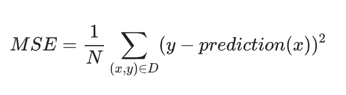
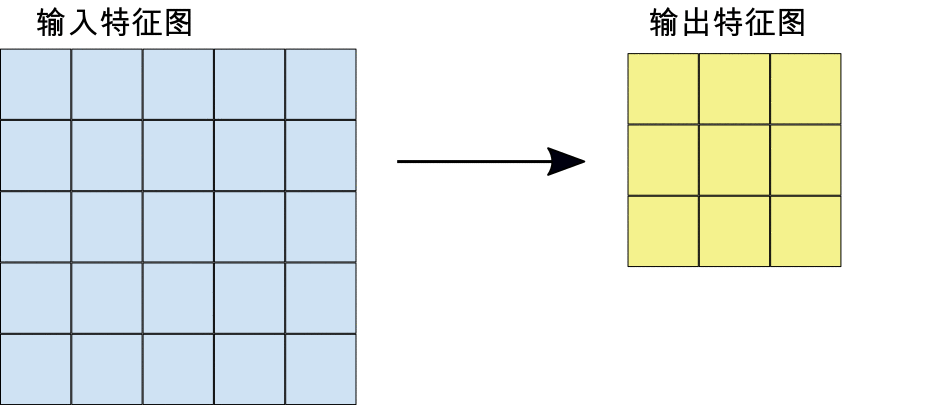
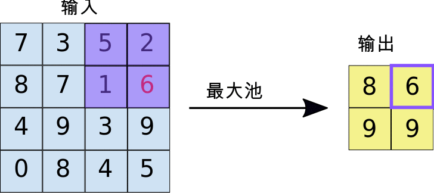
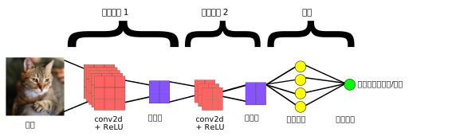

# [Google Machine Learning Courses](https://developers.google.com/machine-learning/crash-course/ml-intro)  
## Introduction to ML
* First, it gives you a tool to reduce the time you spend programming.
* Second, it will you to customize your products(100 languages tranlate).
* Third, solve problems that you,as a programmer,have no idea to solve(recognize faces,understand speech).
* Fourth, change the way you think about a problem .
  * logic -> statistics analyze 
  * mathematical science -> natural science
## Framing  
* __BASIC PRAMEOWRK:__ supervised machine learning.
* __label(y):__ it's the target we're trying to predict,something like 'spam or not spam'.
* __feature(x<sub>i</sub>):__ any piece of information,something like words in the email.  
* __example(x):__ one piece of data,for example,one email.
* __labeled example(x,y)__  
* __unlabeled example(x,?)__
* __model(prediction(x)=y'):__ the thing that doing predicting,it's the thing that we're going to create.
## Descending into ML  

## Reducing Loss
### Gradient Descent

### Learning Rate
also sometimes called step size
### Stochastic Gradient Descent

## First Steps with TF  

### TF Progarmming Exercise
python的list和np.array的区别:list可以存放不同类型的数据,并且是指针,而且没有ndim、shape、dtype等属性.
* NumPy
  NumPy is a Python library for creating and manipulating vectors and matrices. 
  ```python
  import numpy as np
  one_dimensional_array = np.array([1.2, 2.4, 3.5, 4.7, 6.1, 7.2, 8.3, 9.5])
  two_dimensional_array = np.array([[6, 5], [11, 7], [4, 8]])
  #整数序列
  sequence_of_integers = np.arange(5, 12)  # => [ 5  6  7  8  9 10 11]
  #随机整数50-100的array,长度6
  random_integers_between_50_and_100 = np.random.randint(low=50, high=101, size=(6))
  #随机浮点数0-1的array,长度6
  random_floats_between_0_and_1 = np.random.random([6])
  ```
* pandas  
  是一种数据分析API  
  ```python
  #2020年教程
  import numpy as np
  import pandas as pd
  my_data = np.array([[0, 3], [10, 7], [20, 9], [30, 14], [40, 15]])
  # Create a Python list that holds the names of the two columns.
  my_column_names = ['temperature', 'activity']
  # Create a DataFrame.
  my_dataframe = pd.DataFrame(data=my_data, columns=my_column_names)
  print(my_dataframe)
  # =>    temperature  activity
  # => 0            0         3
  # => 1           10         7
  # => 2           20         9
  # => 3           30        14
  # => 4           40        15
  # Create a new column named combo.
  my_dataframe["adjusted"] = my_dataframe["activity"] + 2
  # Print the entire DataFrame
  print(my_dataframe)
  # =>    temperature  activity  adjusted
  # => 0            0         3         5
  # => 1           10         7         9
  # => 2           20         9        11
  # => 3           30        14        16
  # => 4           40        15        17
  # Rows #0, #1, and #2
  print(my_dataframe.head(3), '\n')
  # Row #2
  print(my_dataframe.iloc[[2]], '\n')
  # Rows #1, #2, and #3
  print(my_dataframe[1:4], '\n')
  # Column 'temperature'
  print(my_dataframe['temperature'])
  # 引用数据-共享一个数据
  reference_to_my_dataframe  =  my_dataframe
  # 复制数据-不相关
  copy_of_my_dataframe = my_dataframe.copy()
  ```
  ```python
  #老版本教程
  from __future__ import print_function
  import pandas as pd
  import numpy as np
  pd.__version__

  california_housing_dataframe = pd.read_csv("https://download.mlcc.google.cn/mledu-datasets/california_housing_train.csv", sep=",")
  california_housing_dataframe.describe()
  california_housing_dataframe.head()
  california_housing_dataframe.hist('housing_median_age')

  city_names = pd.Series(['San Francisco', 'San Jose', 'Sacramento'])
  population = pd.Series([852469, 1015785, 485199])
  citys = pd.DataFrame({ 'City name': city_names, 'Population': population})
  print(type(cities['City name']))
  cities['City name']
  population / 1000.
  np.log(population)
  population.apply(lambda val: val > 1000000)
  ```
* first steps with tensorflow  
  ```python
  from __future__ import print_function
  import math
  from IPython import display
  from matplotlib import cm
  from matplotlib import gridspec
  from matplotlib import pyplot as plt
  import numpy as np
  import pandas as pd
  from sklearn import metrics
  %tensorflow_version 1.x
  import tensorflow as tf
  from tensorflow.python.data import Dataset

  tf.logging.set_verbosity(tf.logging.ERROR)
  pd.options.display.max_rows = 10
  pd.options.display.float_format = '{:.1f}'.format

  california_housing_dataframe = pd.read_csv("https://download.mlcc.google.cn/mledu-datasets/california_housing_train.csv", sep=",")

  california_housing_dataframe = california_housing_dataframe.reindex(np.random.permutation(california_housing_dataframe.index))
  california_housing_dataframe["median_house_value"] /= 1000.0
  california_housing_dataframe
  california_housing_dataframe.describe()
  ```
## 泛化
## 训练集和测试集ß
## 验证集(Validation)
如果经常用测试集来验证模型,可能会出现在不自觉的拟合了测试集的情况,需要引入验证集的概念.

# [图像分类实践课程](https://developers.google.com/machine-learning/practica/image-classification)
## 卷积神经网络
卷积神经网络 (CNN) 可用于逐步提取越来越高级别的图像内容表示结果,CNN 包括多个模块，每个模块执行三个操作:
1. 卷积  
  卷积会提取输入特征图的图块，并向这些图块应用过滤器以计算新特征，生成输出特征图（也称为“卷积特征”，大小和深度可能与输入特征图的不同）。卷积由以下两个参数定义：
   * 所提取图块的大小（通常为 3x3 或 5x5 像素）。  
   * 输出特征图的深度，对应于应用的过滤器数量。  
    
  图 在 5x5 输入特征图（深度为 1）上执行 3x3 卷积（深度也为 1）。在 5x5 特征图中，可以提取图块的 3x3 位置有 9 个，因此该卷积会生成一个 3x3 输出特征图。
2. ReLU激活
  每次执行卷积运算后，CNN 都会向卷积特征应用修正线性单元 (ReLU) 转换，以便将非线性规律引入模型中。ReLU 函数 F(x) = max(0,x) 会针对 x > 0 的所有值返回 x，针对 x ≤ 0 的所有值返回 0。
3. 池化  
  ReLU 之后是池化步骤，即 CNN 会降低卷积特征的采样率（以节省处理时间），从而减少特征图的维数，同时仍保留最关键的特征信息。此过程常用的算法称为最大池化。  
  最大池化采用的运算方式与卷积的运算方式类似。我们在特征图上滑动并提取指定大小的图块。对于每个图块，最大值会输出到新的特征图，所有其他值都被舍弃。最大池化运算采用以下两个参数：  
   * 最大池化过滤器的大小（通常为 2x2 像素）
   * 步长：各提取图块间隔的距离（以像素为单位）。最大池化与卷积不同：在执行卷积期间，过滤器在特征图上逐个像素滑动，而在最大池化过程中，步长会确定每个图块的提取位置。对于 2x2 过滤器，距离为 2 的步长表示最大池化运算将从特征图中提取所有非重叠 2x2 图块:  
    

### 全连接层
卷积神经网络的末端是一个或多个全连接层（当两个层“完全连接”时，第一层中的每个节点都与第二层中的每个节点相连）。全连接层的作用是根据卷积提取的特征进行分类。通常，最后的全连接层会包含一个 softmax 激活函数，该函数会针对模型尝试预测的每个分类标签输出一个概率值（范围为：0-1）。
### 图像识别模型  
  
图 上图中显示的 CNN 包含两个用于提取特征的卷积模块（卷积 + ReLU + 池化）和两个用于分类的全连接层。其他 CNN 可能包含更多或更少的卷积模块和全连接层。工程师会经常进行试验，以便为模型找出可产生最佳结果的配置。
#  [BOOK:Deep Learning with Python]()
## 1. what is deep learning?
### 1.1 Artificial intelligence, machine learning, and deep learning
* relationship: (Artificial intelligence(Machine Learning(Deep learning)))  
* 50年代提出人工智能,从50年代到80年代,科学家们相信人工智能可以通过一系列基于常识的一系列复杂规则实现,called **symbolic** AI.ß
* 虽然 **symbolic** AI可以解决很多好定义、逻辑性强的问题,如下棋,但是无法解决复杂和模糊不清的问题,如图像识别、语音识别、语言翻译.于是machine learning诞生了.  

* 机器学习和数学统计密切相关,但是也有几个很重要的不同点:机器学习的数据集非常大,传统的统计分析无法实践,如贝叶斯分析.因此,机器学习用到很少的数学理论,经常以经验为依据.
#### 1.1.3 Learning representations from data
实现机器学习的必需要素:
* 数据.
* 部分数据的标签(标准答案).
* 一个衡量准确度的方法.  
The central problem in machine learning:to learn useful representations of the input data at hand—representations that get us closer to the expected output. 
#### 1.1.4 The 'deep' in deep learning
* 深度学习不是指深度理解
* what deep learning is, technically: a multistage way to learn data representations.
#### 1.1.5 Understanding how deep learning works, in three figures
## 2 Before we begin: the mathematical building blocks of neural networks
### 2.1 A first look at a neural network
  ```python
  # 1.The MNIST dataset comes preloaded in Keras, in the form of a set of four Numpy arrays.
  from keras.datasets import mnist
  (train_images, train_labels), (test_images, test_labels) = mnist.load_data()
  # 2.build the network
  from keras import models
  from keras import layers
  network = models.Sequential()
  network.add(layers.Dense(512, activation='relu', input_shape=(28 * 28,))) network.add(layers.Dense(10, activation='softmax'))
  # 3.To make the network ready for training, we need to pick three more things, as part of the compilation step:loss function,optimizer,metrics.
  of the compilation step:
  network.compile(optimizer='rmsprop', loss='categorical_crossentropy',
                  metrics=['accuracy'])
  # 4.reshape datas
  train_images = train_images.reshape((60000, 28 * 28)) train_images = train_images.astype('float32') / 255
  test_images = test_images.reshape((10000, 28 * 28)) test_images = test_images.astype('float32') / 255
  # 5.categorically encode the labels(explain in chapter 3)
  from keras.utils import to_categorical
  train_labels = to_categorical(train_labels)
  test_labels = to_categorical(test_labels)
  # 6.training
  network.fit(train_images, train_labels, epochs=5, batch_size=128)
  # 7.evaluating
  test_loss, test_acc = network.evaluate(test_images, test_labels)
  print('test_acc:', test_acc)
  ```
### 2.2 Data representations for neural networks
  * tensor
    * 0D tensor(scalar) 常数,标量,无向性量,0维张量
    * 1D tensor(vector) 向量,1维张量
    * 2D tensor(matrix) 矩阵,2维张量
    * 3D tensor 3维张量,a cube of numbers
  ```python
  >>> import numpy as np
  >>> x0 = np.array(12)
  >>> x1 = np.array([12, 3, 6, 14])
  >>> x2 = np.array([[5, 78, 2, 34, 0], [6, 79, 3, 35, 1],[7, 80, 4, 36, 2]])
  >>> x0.ndim x0.shape x0.dtype
  0 () unit8
  >>> x1.ndim x1.shape
  1 (4,)
  >>> x2.ndim x2.shape
  2 (3,5)
  ```
  * 注意区分2维向量和2维张量说法的区别!!!
  * By packing 3D tensors in an array, you can create a 4D tensor, and so on. In deep learning, you’ll generally manipulate tensors that are 0D to 4D, although you may go up to 5D if you process video data.
#### 2.2.5 Key attributes
张量的构成属性:
1. 维度
2. 形状
3. 数据类型
#### 2.2.6 Manipulating tensors in Numpy
* 可以用冒号“:”选取张量特定区域的数据!
#### 2.2.7 The notion of data batches
张量的第一个维度(first axis、axis 0、samples axis、samples dimension)通常叫做样品维度.  
深度学习模型通常不一次性处理全部数据集,而是,把数据分成一些小的批量!  
运用小批量处理的张量,the first axis is called the batch axis or batch dimension!
#### 2.2.8 Real-world examples of data tensors
实际运用中的张量举例
* Vector data—2D tensors of shape(samples,features)
* Timeseries data or sequence data—3D tensors of shape (samples, timesteps,
features)
* Images—4D tensors of shape(samples,height,width,channels)or(samples,
channels, height, width)
* Video —5D tensors of shape (samples, frames, height, width, channels) or
(samples, frames, channels, height, width)
### 2.3 The gears of neural networks: tensor operations
* 介绍了relu全连接层(密度层、激活层)的原理,用到了三种张量操作符,点积、加法、relu
```py
keras.layers.Dense(512, activation='relu')
# ||
# VV
output = relu(dot(W, input) + b) #relu(x) is max(x,0)
```
#### 2.3.1 Element-wise operations
介绍了张量操作符的自适应大量平行操作功能及底层原理:for循环,以下为加法的底层实现:
```py
def naive_add(x, y):
assert len(x.shape) == 2 assert x.shape == y.shape
x = x.copy()
for i in range(x.shape[0]):
for j in range(x.shape[1]): x[i, j] += y[i, j]
return x
```
#### 2.3.2 Broadcasting
当两个张量的维度不同(形状不同)时也可以进行张量操作,这种特性叫做Broadcasting,以下为加法的底层实现:
```py
def naive_add_matrix_and_vector(x, y): assert len(x.shape) == 2
assert len(y.shape) == 1
assert x.shape[1] == y.shape[0]
x = x.copy()
for i in range(x.shape[0]):
for j in range(x.shape[1]): x[i, j] += y[j]
return x
```
#### 2.3.3 tensor dot 
FAO:review
TBS:__* 和 dot(数学上用‘.’)区别???__  
不同类型的的张量之间的点积底层实现!
#### 2.3.4 tensor reshaping
```py
x =np.array([[0,1],[2,3],[4,5]]);
x = x.reshape((6, 1);   #变换形状
x = np.transpose(x);    #\对称变换
```
#### 2.3.5 Geometric interpretation of tensor operations
张量操作的几何学解释:把复杂的数据及通过层层转换成有规律的数据.
### 2.4 The engine of neural networks:gradient-based optimization
训练的过程:
1. 选取一个批量的样本数据,和相应的标签
2. 运行样本数据计算各个的预测值
3. 通过标签和预测值计算loss
4. 更新weights降低loss  

关键在实现第四部,一个笨办法是固定除了一个weight以外的所有weights,轮流调节weight达到最小的loss,但是不现实!  
可行的办法:计算梯度,往负梯度方向取值,以降低loss
#### 2.4.1 导数
#### 2.4.2 张量的导数:梯度
#### 2.4.3 随机梯度下降
通过梯度下降方法更新的训练过程:  
1. Draw a batch of training samples x and corresponding targets y.
2. Run the network on x to obtain predictions y_pred.
3. Compute the loss of the network on the batch, a measure of the mismatch
between y_pred and y.
4. Compute the gradient of the loss with regard to the network’s parameters (a
backward pass).
5. Move the parameters a little in the opposite direction from the gradient—for
example W -= step * gradient—thus reducing the loss on the batch a bit. 

difference between: **SGD(single sample)** --> **mini-batch SGD(10-1000)** --> **batch SGD(all)**   
其他的SGD变种,不仅仅查看当前梯度来更新权重,还将考虑之前的权重,最具代表性的就是考虑动量,它可以解决收敛速度和局部最小值的问题:there exist multiple variants of SGD that differ by taking into account previous weight updates when computing the next weight update, rather than just looking at the current value of the gradients. There is, for instance, SGD with momen- tum, as well as Adagrad, RMSProp, and several others. Such variants are known as opti- mization methods or optimizers. In particular, the concept of momentum, which is used in many of these variants, deserves your attention. Momentum addresses two issues with SGD: convergence speed and local minima. 

#### 2.4.4  Chaining derivatives: the Backpropagation algorithm
链式法则: f'(x) = f'(g(x)) * g'(x)  
TBS:反向传播、反转模式微分: Applying the chain rule to the computation of the gradient values of a neural network gives rise to an algorithm called Backpropagation (also sometimes called reverse-mode differentiation).  
TBS:symbolic differentiation 符号微分
### 2.5 Looking back our first example
```py
#input data
(train_images, train_labels), (test_images, test_labels) = mnist.load_data()
train_images = train_images.reshape((60000, 28 * 28)) 
train_images = train_images.astype('float32') / 255
test_images = test_images.reshape((10000, 28 * 28)) 
test_images = test_images.astype('float32') / 255
#neural network
network = models.Sequential()
network.add(layers.Dense(512, activation='relu', input_shape=(28 * 28,))) 
network.add(layers.Dense(10, activation='softmax'))
#network compilation
network.compile(optimizer='rmsprop', loss='categorical_crossentropy', metrics=['accuracy'])
#training
network.fit(train_images, train_labels, epochs=5, batch_size=128)
```
## 3 Getting started with neural networks
三个例子,二元分类、多元分类、数值回归:
* Classifying movie reviews as positive or negative (binary classification) 
* Classifying news wires by topic (multiclass classification)
* Estimating the price of a house, given real-estate data (regression)
### 3.1 Anatomy of a neural network
combination of neural networks:
1. datas with labels.
2. layers that combine into a network(model).
3. loss functions.
4. optimizer.

#### 3.1.1 layers: the building blocks of deep learning 

#### 3.1.2 models

#### 3.1.3 loss functions and optimizers
1.  Loss function (objective function)—The quantity that will be minimized during training. It represents a measure of success for the task at hand.
2.  Optimizer—Determines how the network will be updated based on the loss func- tion. It implements a specific variant of stochastic gradient descent (SGD).
* the importance of choosing the Loss function
#### 3.2 keras

#### 3.3 Setting up a deep-learning workstation
#### 3.4 Classifying movie reviews: a binary classification example
```python
# 把评论的整数字典索引序列还原为评论
from keras.datasets import imdb
(train_data, train_labels), (test_data, test_labels) = imdb.load_data( num_words=10000)
max([max(sequence) for sequence in train_data])
word_index = imdb.get_word_index()
reverse_word_index = dict([(value, key) for (key, value) in word_index.items()])
decoded_review = ' '.join([reverse_word_index.get(i - 3, '?') for i in train_data[0]])
print(decoded_review)

import numpy as np
# 函数:把评论的整数字典索引序列转换为一个10000维的0,1张量
def vectorize_sequences(sequences, dimension=10000): 
  results = np.zeros((len(sequences), dimension)) 
  for i, sequence in enumerate(sequences):
    results[i, sequence] = 1. 
  return results
# 对训练和测试数据进行张量转换
x_train = vectorize_sequences(train_data)
x_test = vectorize_sequences(test_data)
y_train = np.asarray(train_labels).astype('float32') 
y_test = np.asarray(test_labels).astype('float32')
print("Raw train data:",train_data.ndim,train_data.shape ,train_data.dtype)
print("Array train data:",x_train.ndim,x_train.shape ,x_train.dtype)
print("Raw test data:",test_data.ndim,test_data.shape ,test_data.dtype)
print("Array test data:",x_test.ndim,x_test.shape ,x_test.dtype)
print("Raw train labels:",train_labels.ndim,train_labels.shape ,train_labels.dtype)
print("Array train labels:",y_train.ndim,y_train.shape ,y_train.dtype)
print("Raw test labels:",test_labels.ndim,test_labels.shape ,test_labels.dtype)
print("Array test labels:",y_test.ndim,y_test.shape ,y_test.dtype)
# 创建一个3层的深度学习模型
from keras import models
from keras import layers
model = models.Sequential()
model.add(layers.Dense(16, activation='relu', input_shape=(10000,))) 
model.add(layers.Dense(16, activation='relu')) 
model.add(layers.Dense(1, activation='sigmoid'))

# 把训练集分成训练集和验证集两部分=>
x_val = x_train[:10000]
y_val = y_train[:10000]
partial_x_train = x_train[10000:]
partial_y_train = y_train[10000:]
print("x_val data:",x_val.ndim,x_val.shape ,x_val.dtype)
print("x_train data:",x_train.ndim,x_train.shape ,x_train.dtype)
# 编译生成模型,设定优化器、损失函数、评价标准.
model.compile(optimizer='rmsprop', loss='binary_crossentropy',
              metrics=['acc'])
# SGD随机梯度下降方法,训练模型=>
history = model.fit(partial_x_train, partial_y_train,
                    epochs=20,
                    batch_size=512,
                    validation_data=(x_val, y_val))
history_dict = history.history
history_dict.keys()

# 训练集和验证集的损失函数图表
import matplotlib.pyplot as plt
history_dict = history.history
loss_values = history_dict['loss'] 
acc_values = history_dict['acc'] 
val_loss_values = history_dict['val_loss']
epochs = range(1, len(acc_values) + 1)
plt.plot(epochs, loss_values, 'bo', label='Training loss')
plt.plot(epochs, val_loss_values, 'b', label='Validation loss')
plt.title('Training and validation loss') 
plt.xlabel('Epochs')
plt.ylabel('Loss')
plt.legend()
plt.show()

# 训练集和验证集的准确度函数图表
plt.clf()
acc_values = history_dict['acc'] 
val_acc_values = history_dict['val_acc']
plt.plot(epochs, acc_values, 'bo', label='Training acc') 
plt.plot(epochs, val_acc_values, 'b', label='Validation acc') 
plt.title('Training and validation accuracy') 
plt.xlabel('Epochs')
plt.ylabel('Loss') 
plt.legend()
plt.show()

# 使用模型对测试集预测=>
model.predict(x_test)
```
## 5 Deep learning for computer vision  


