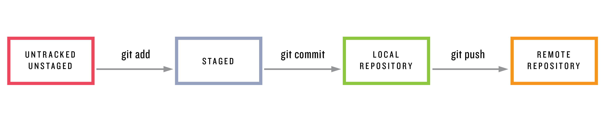

---
## 分割符号
---

分割符号

---

# 标题 1

## 标题 2

### 标题 3

> 着重文字符号

<center>居中渲染</center>

```
code 1
code 2
code 3
```

`文字高亮` `文字高亮`

_斜体_  
**粗体**  
~~删除线~~  
**_斜粗体_**  
**_~~斜粗体删除线~~_**



[百度](http://baidu.com "悬停显示")

<http://baidu.com/>

1. 1111111
2. 2222222
3. 3333333

- 111111
  - 121212
  - 131313
- 222222

- [x] Markdown
- [ ] Markdown

| Name  | sex | age |
| ----- | --- | --- |
| Name1 | 男  | 90  |
| Name2 | 男  | 100 |
| Name3 | 女  | 90  |

X<sub>2<sub>

X<sup>2<sup>

<ruby>日本<rt>にほん</rt></ruby>
