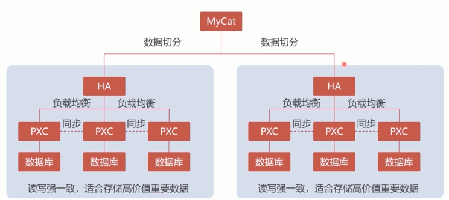
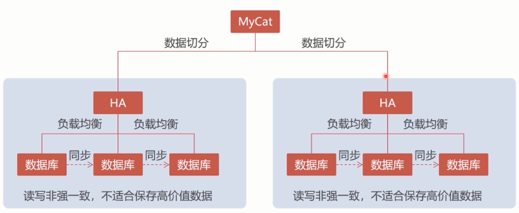
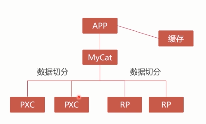
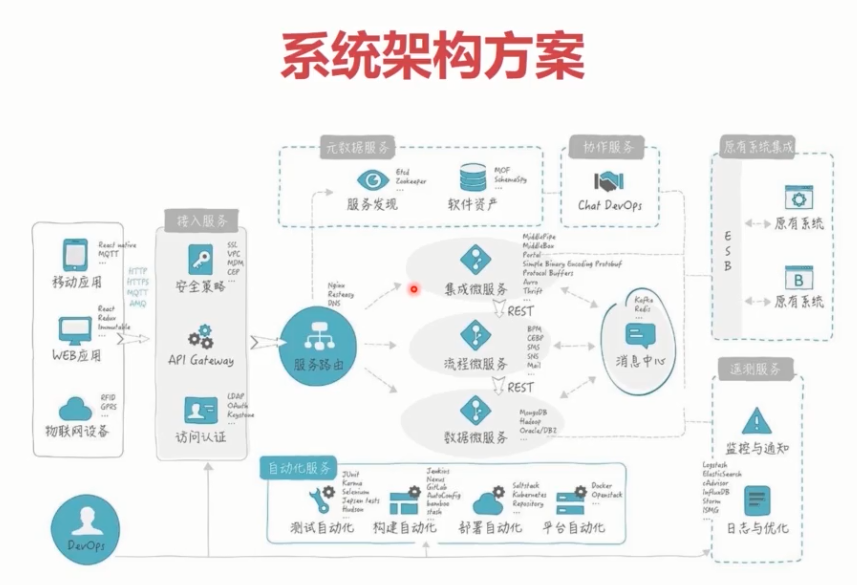

# [MySQL8.0 CentOS Install](https://www.tecmint.com/install-latest-mysql-on-rhel-centos-and-fedora/)
# [MySQL PXC](https://www.imooc.com/learn/993)
## Docker虚拟机
## mysql测试命令
mysqlslap -hlocalhost -uroot -p85021687 -P3306
--concurrency=5000 --iterations=1 --auto=-generate-sql
--auto-generate-sql-load-type=mixed
--auto-generate-sql-add-autoincrement
--engine=innodb
--number-of-queries=5000
--debug-info
## mysql 单表数据超过2000万，性能会非常差，数据切分MyCat。
## PXC集群，强一致性

## Replication集群，读写非强一致性，不适合保证高价值数据，读写数据快。

## 最终集群方案

## 传统架构SSH,SSI
## 微服务架构

# [数据库设计范式(normal format)](https://www.zhihu.com/question/24696366)
1NF,2NF,3NF,BCNF,4NF,5NF
# [连接池](https://blog.csdn.net/tototuzuoquan/article/details/78573955)
如果客户端和MySQL数据库之间有连接池或Proxy代理，一般在客户端推荐使用短连接。对于长连接的使用一定要慎重，不可滥用。如果没有每秒几百、上千的新连接请求，就不一定需要长连接，也无法从长连接中得到太多好处。在Java语言中，由于有连接池，如果控制得当，则不会对数据库有较大的冲击，但PHP的长连接可能导致数据库的连接数超过限制，或者占用过多的内存。

