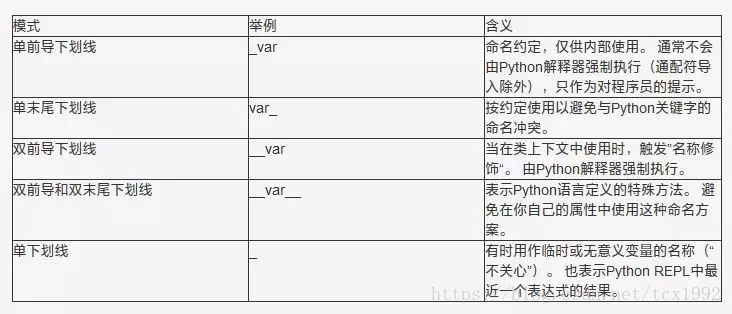

# python
## [python 下划线](https://blog.csdn.net/tcx1992/article/details/80105645) 

## [lambda](https://blog.csdn.net/answer3lin/article/details/86352009)
```python
bar = lambda:'beginman'
print(bar())
def bar():return 'beginman'
print(bar())
```